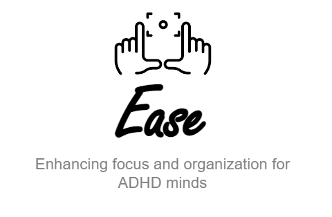
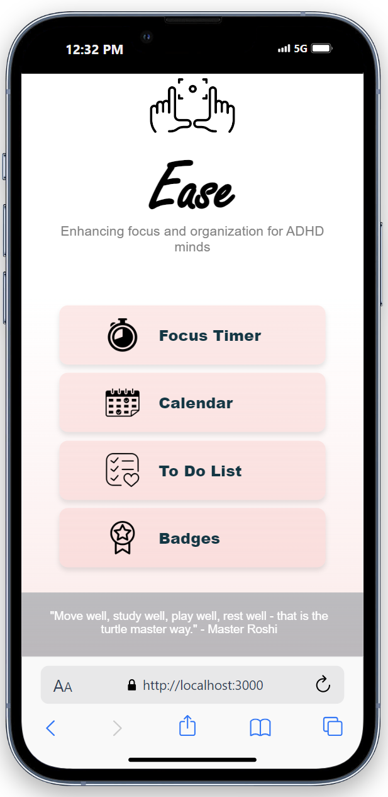
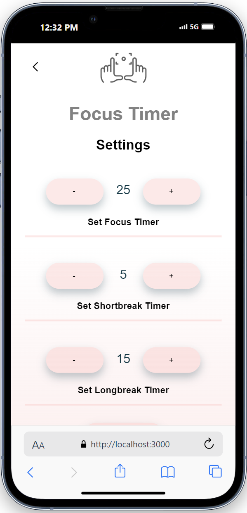
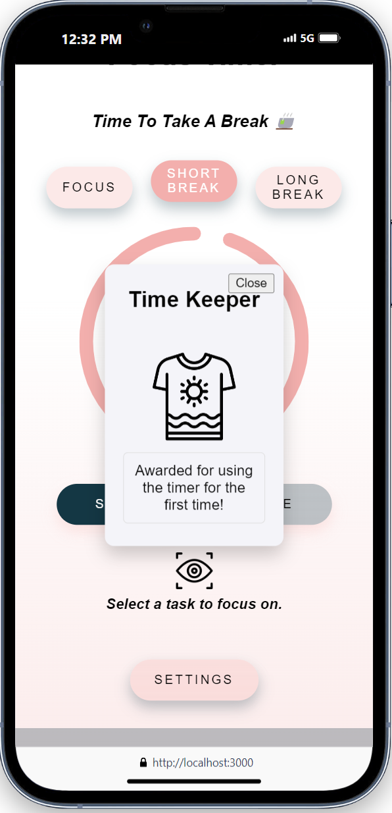
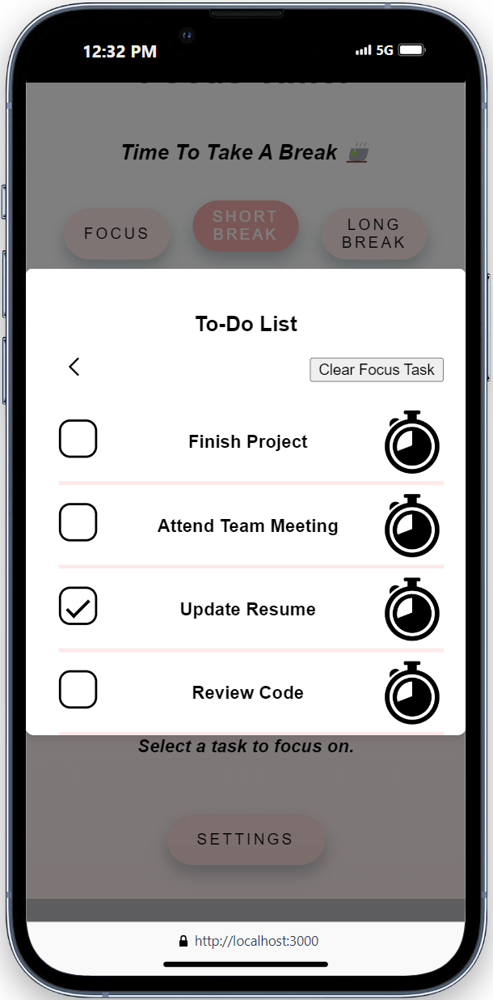
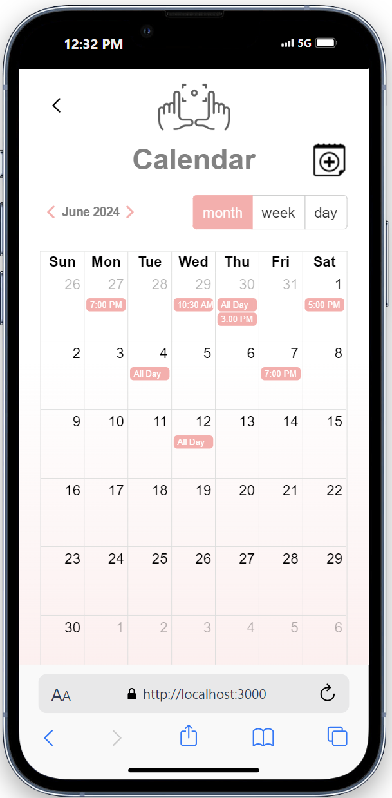
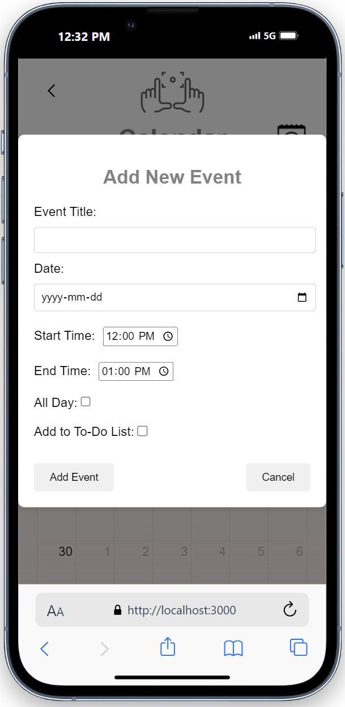

<!-- Improved compatibility of back to top link: See: https://github.com/othneildrew/Best-README-Template/pull/73 -->
<a name="readme-top"></a>
<!--
*** Thanks for checking out the Best-README-Template. If you have a suggestion
*** that would make this better, please fork the repo and create a pull request
*** or simply open an issue with the tag "enhancement".
*** Don't forget to give the project a star!
*** Thanks again! Now go create something AMAZING! :D
-->


<!-- PROJECT SHIELDS -->
<!--
*** I'm using markdown "reference style" links for readability.
*** Reference links are enclosed in brackets [ ] instead of parentheses ( ).
*** See the bottom of this document for the declaration of the reference variables
*** for contributors-url, forks-url, etc. This is an optional, concise syntax you may use.
*** https://www.markdownguide.org/basic-syntax/#reference-style-links
-->

<!-- PROJECT LOGO -->
<br />
<div align="center">
  <a href="https://github.com/alyshajoy/finalproject">
    
  </a>

<h3 align="center">Ease</h3>

  <p align="center">
    A toolkit designed to help organize the lives of those with ADHD.
    <br />
  </p>
</div>


<!-- TABLE OF CONTENTS -->
<details>
  <summary>Table of Contents</summary>
  <ol>
    <li>
      <a href="#about-the-project">About The Project</a>
      <ul>
        <li><a href="#built-with">Built With</a></li>
      </ul>
    </li>
    <li><a href="#getting-started">Getting Started</a></li>
    <li><a href="#usage">Usage</a></li>
    <li><a href="#license">License</a></li>
    <li><a href="#contact">Contact</a></li>
    <li><a href="#acknowledgments">Acknowledgments</a></li>
  </ol>
</details>


<!-- ABOUT THE PROJECT -->
## About The Project


#### Welcome to Ease!

Ease is a toolkit designed to help those that struggle with ADHD. 
The toolkit is composed of a focus/pomodoro timer,  a calendar planner, a to do list and an achievement system to create positive reinforcement upon completion of tasks. 

This project is a final project for the Full-Stack Web Development program offered by Lighthouse Labs. It is intended for mobile use for ease of accessibility. 

The app is not intended for commercial use and is meant for learning purposes only. 

**_Inspired by a project member that has children with ADHD._**


<!-- Here's a blank template to get started: To avoid retyping too much info. Do a search and replace with your text editor for the following: `github_username`, `repo_name`, `twitter_handle`, `linkedin_username`, `email_client`, `email`, `project_title`, `project_description` -->

<p align="right">(<a href="#readme-top">back to top</a>)</p>


### Built With

[![React][React.js]][React-url]
<br>
[![Node][Node.js]][Node-url]
<br>
[![PostgreSQL][psql]][psql-url]
<br>
[![Express][Express.js]][Express-url]
<br>
[![Sass][Sass]][Sass-url]

<p align="right">(<a href="#readme-top">back to top</a>)</p>


<!-- GETTING STARTED -->
## Getting Started

1. Install Node.js (v. 12.22.9 or later required)
2. Install PostgreSQL (v. 10.14 or later required)
3. Clone repository into an empty directory.
4. Install package dependencies in both frontend & backend folders.
5. Create a copy of .env.example with user psql credentials in project root folder.

#### Backend commands

*** Use following instructions within backend directory ***

1. Start database by running 'startpostgres' command.
2. Reset the database using the command 

```sh 
  npm run db:reset
```

3.  Start the backend server

```sh
  npm start
```

#### Frontend commands 

*** Use following instructions within frontend directory ***


1. Start the application front end
```sh
  npm start
```

<!-- USAGE EXAMPLES -->
## Usage

### Create a pomodoro focus that helps you stay focused on set tasks.
<br />


### Receive rewards for completing tasks within the app.
<br />


### Organize tasks using a todo list
<br />


### Arrange and organize appointments using the calender.
<br />



<p align="right">(<a href="#readme-top">back to top</a>)</p>

<!-- CONTRIBUTING -->
## Contributing

Contributions are what make the open source community such an amazing place to learn, inspire, and create. Any contributions you make are **greatly appreciated**.

If you have a suggestion that would make this better, please fork the repo and create a pull request. You can also simply open an issue with the tag "enhancement".
Don't forget to give the project a star! Thanks again!

1. Fork the Project
2. Create your Feature Branch (`git checkout -b feature/AmazingFeature`)
3. Commit your Changes (`git commit -m 'Add some AmazingFeature'`)
4. Push to the Branch (`git push origin feature/AmazingFeature`)
5. Open a Pull Request

<p align="right">(<a href="#readme-top">back to top</a>)</p>


<!-- LICENSE -->
## License

Creation of this app is intended for educational purposes and is not licensed for commercial use.

<p align="right">(<a href="#readme-top">back to top</a>)</p>


<!-- CONTACT -->
## Contact

Sasha Young aka Faelixx - [@SashaYoung - LinkedIn](https://www.linkedin.com/in/sasha-young-42592317a/) - sasha.taylor7@gmail.com

Project Link: [https://github.com/faelixx/ease](https://github.com/faelixx/ease)

<p align="right">(<a href="#readme-top">back to top</a>)</p>


<!-- ACKNOWLEDGMENTS -->
## Acknowledgments

A big thank you to the project members that had a big hand in making ease happen. 
You can find the original repository and contributing members' github pages below. 

* [Original Project Repository](https://github.com/alyshajoy/final-project)
* [Alysha Huot Github](https://github.com/alyshajoy)
* [Pihu Gupta Github](https://github.com/p-gupta98)
* [Paul Jean Github](https://github.com/Fatbobot)

<p align="right">(<a href="#readme-top">back to top</a>)</p>


<!-- MARKDOWN LINKS & IMAGES -->
<!-- https://www.markdownguide.org/basic-syntax/#reference-style-links -->

[React.js]: https://img.shields.io/github/v/tag/facebook/react?style=for-the-badge&logo=React&logoColor=white&label=React
[React-url]: https://reactjs.org/
[Express.js]: https://img.shields.io/github/v/tag/expressjs/express?style=for-the-badge&logo=Express&label=Express&labelColor=White
[Express-url]: https://expressjs.com/
[Node.js]: https://img.shields.io/github/v/tag/nodejs/node?style=for-the-badge&logo=Node.js&logoColor=white&label=Node.js
[Node-url]: https://nodejs.org/en
[psql]: https://img.shields.io/github/v/tag/postgres/postgres?style=for-the-badge&logo=PostgreSQL&logoColor=white&label=PostgreSQL

[psql-url]: https://www.postgresql.org
[Sass]: https://img.shields.io/github/v/tag/sass/sass?style=for-the-badge&logo=Sass&logoColor=white&label=Sass
[Sass-url]: https://sass-lang.com
